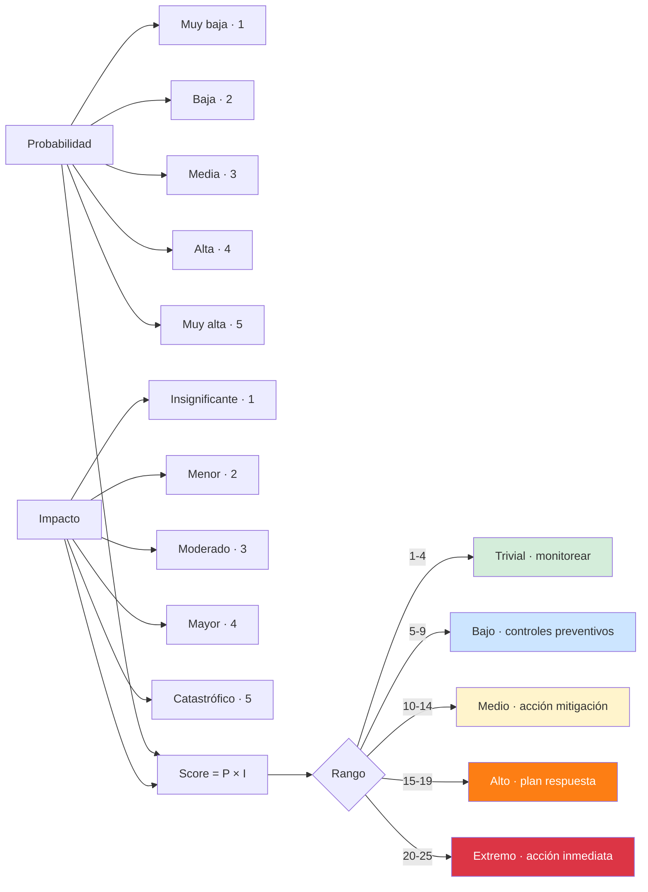
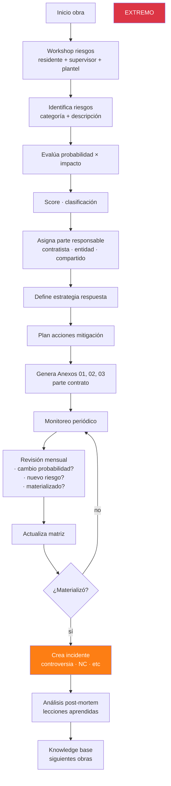

# 51 · Gestión de riesgos · Matriz · Anexos 1, 2, 3 contrato

★ Anexos 1, 2, 3 contrato 037 lo exigen como parte integrante. Cláusula 13 contrato.

## Marco legal · gestión riesgos

```
Base legal:
  - Art 43 RLGCP · Plan de gestión de riesgos
  - Cláusula 13 contrato · Gestión de riesgos
  - Anexo 01 · Identificación de riesgos
  - Anexo 02 · Plan de respuesta riesgos
  - Anexo 03 · Asignación riesgos a partes

Obligación contractual:
  Contratista debe identificar · evaluar · mitigar
  durante toda ejecución contractual
  Reportes periódicos al supervisor
```

## Categorías riesgos típicos obras públicas

```mermaid
flowchart TB
    RIESGOS[Riesgos obra] --> CAT[Categorías]

    CAT --> TEC[Técnicos]
    CAT --> EXT[Externos]
    CAT --> CONTR[Contractuales]
    CAT --> ECO[Económicos]
    CAT --> AMB[Ambientales]
    CAT --> SOC[Sociales]
    CAT --> SST[Seguridad]

    TEC --> T1[Diseño deficiente]
    TEC --> T2[Especificaciones ambiguas]
    TEC --> T3[Cambios alcance]
    TEC --> T4[Tecnología nueva]
    TEC --> T5[Vicios ocultos terreno]

    EXT --> E1[Clima · lluvia · sismo]
    EXT --> E2[Falta predio]
    EXT --> E3[Servicios públicos no liberados]
    EXT --> E4[Conflictividad social]
    EXT --> E5[Hallazgos arqueológicos]

    CONTR --> C1[Pago tardío entidad]
    CONTR --> C2[Cambios prioridades]
    CONTR --> C3[Demora aprobaciones]
    CONTR --> C4[Penalidades]

    ECO --> EC1[Inflación]
    ECO --> EC2[Variación insumos]
    ECO --> EC3[Tipo cambio]
    ECO --> EC4[Liquidez]

    AMB --> AM1[Lluvia obra abierta]
    AM1 --> AM2[Restricciones ambientales]

    SOC --> S1[Comunidad afectada]
    SOC --> S2[Trabajadores conflicto]

    SST --> SS1[Accidentes]
    SST --> SS2[Trabajos altura]
```



## Matriz probabilidad × impacto



## 4 estrategias respuesta

```
1. EVITAR · cambiar plan para eliminar riesgo
   Ej: cambiar diseño que evita zona arqueológica

2. TRANSFERIR · pasar a tercero
   Ej: contratar seguro CAR · garantizar con SC

3. MITIGAR · reducir probabilidad o impacto
   Ej: capacitación SST reduce probabilidad accidentes

4. ACEPTAR · monitorear sin acción activa
   Ej: aceptar lluvia leve · plan reprogramación
```

## Schema gestión riesgos

```sql
riesgos_proyecto (
  id uuid PRIMARY KEY,
  proyecto_id uuid,
  numero varchar UNIQUE,                        -- 'R-2026-001'

  -- Identificación
  categoria ENUM ('tecnico','externo','contractual','economico','ambiental','social','sst'),
  descripcion text,
  causa_potencial text,
  consecuencia_potencial text,

  -- Evaluación
  probabilidad integer CHECK (probabilidad BETWEEN 1 AND 5),
  impacto integer CHECK (impacto BETWEEN 1 AND 5),
  score integer GENERATED AS (probabilidad * impacto) STORED,
  nivel ENUM ('trivial','bajo','medio','alto','extremo'),

  -- Asignación (Anexo 03 · qué parte responde)
  asignado_a ENUM ('contratista','entidad','compartido','tercero_seguro'),
  responsable_user_id uuid,

  -- Respuesta
  estrategia ENUM ('evitar','transferir','mitigar','aceptar'),
  acciones_planificadas text,
  fecha_implementacion date,
  costo_mitigacion_estimado decimal(14,2),

  -- Monitoreo
  fecha_proxima_revision date,
  trigger_alerta varchar,                       -- evento que dispararía
  indicador_temprano varchar,                   -- KPI a monitorear

  -- Estado
  estado ENUM (
    'identificado',
    'evaluado',
    'mitigando',
    'mitigado',
    'materializado',                             -- ocurrió
    'cerrado'
  ),

  -- Si se materializó
  materializo_en_evento_id uuid,                 -- vincula a incidente · controversia
  costo_real_impacto decimal(14,2),

  archivo_anexo01_pdf_nas text,                  -- identificación
  archivo_anexo02_pdf_nas text,                  -- plan respuesta
  archivo_anexo03_pdf_nas text,                  -- asignación

  created_at, updated_at
)

riesgos_revisiones (
  id uuid PRIMARY KEY,
  riesgo_id uuid,
  fecha_revision date,
  cambio_probabilidad int,
  cambio_impacto int,
  notas text,
  acciones_actualizadas text,
  user_id uuid
)
```

## Flujo identificación + monitoreo



## Reportes riesgos

```
1. Matriz riesgos visual
   Heatmap 5x5 · cada riesgo en celda
   Color severidad

2. Top riesgos extremos / altos
   Acciones planificadas
   Responsables · plazos

3. Riesgos materializados
   % de identificados que ocurrieron
   Costo real vs estimado
   Lecciones aprendidas

4. Asignación por parte
   Riesgos contratista vs entidad
   Sustento ante reclamos

5. Indicadores tempranos
   KPIs que sugieren materialización
   Alertas predictivas
```

## KPIs

| KPI | Target |
|---|---|
| Riesgos identificados al inicio | > 30 (lista exhaustiva) |
| Riesgos extremos sin plan | 0 |
| % riesgos materializados | < 30% |
| Costo real impacto vs estimado | < 110% |
| Riesgos identificados durante obra | > 5 (vigilancia activa) |

## Prioridad: **ALTA**
