# AUDITORÍA TÉCNICA · MM HighMetrik ERP

Diseño actual: **MVP académico**. No enterprise-grade. Fundación correcta, ejecución débil. 10 huecos críticos detectados. Sin corrección, ERP romperá en producción al primer cierre mensual real.

Calificación brutal:
```
Funcional      : 6 / 10  ← cubre flujos típicos · no excepciones
Contable       : 4 / 10  ← timing eventos contables incorrecto
Tributario     : 2 / 10  ← detracción/retención/percepción ausentes
Contractual    : 7 / 10  ← Ley 32069 mapeada · falta ejecución detalle
Trazabilidad   : 5 / 10  ← audit log existe · no inmutable · no event sourcing
Performance    : 3 / 10  ← agregaciones síncronas · sin CQRS · sin views
Escalabilidad  : 3 / 10  ← single-tenant implícito · sin sharding obras
Resiliencia    : 2 / 10  ← sin colas · sin batch · sin retries · sin dead letter
```

Veredicto: **No deployar a producción real con > 3 obras simultáneas**.

---

## P1 · ÍNDICE UNIFICADO + REAJUSTE POLINÓMICO ROTO

### Problema detectado

Schema `proyectos.formulaPolinomica jsonb` guarda fórmula. Pero:
- Insumos (`recursos`) NO tienen IU asignado
- Compras NO clasifican por monomio
- Reajuste FP en valorización es **decorativo** (campo manual)
- No hay reconciliación reajuste cobrado vs costo mercado real

### Riesgo real

```
Caso: Obra 8 meses · cemento sube 22% · acero sube 18%
  Reajuste FP cobrado:    + 4.2%  (porque INEI promedio)
  Costo mercado real:     +18.5%  (compras reales)
  GAP no cobrado:        −14.3% × monto materiales
                         ≈ −S/ 95,000 utility quemada
```

Ejemplo Perú real: obra MTC 2023, contratista Cosapi reclamó S/ 4.2M reajuste no reconocido. Arbitraje 18 meses.

### Corrección arquitectura

```sql
-- Catálogo IU (Índices Unificados INEI)
indices_unificados (
  codigo varchar(10) PRIMARY KEY,    -- "21" cemento, "03" acero, "47" mano obra
  descripcion text,
  area_geografica varchar(20),       -- 1=Lima, 2=Norte, etc
  tipo varchar(20)                    -- general | especifico
)

indices_mensuales (
  iu_codigo varchar(10),
  anio_mes char(7),                   -- "2025-12"
  area varchar(20),
  valor decimal(10,4),
  fuente varchar(50),                 -- "INEI Resolución Jefatural"
  fecha_publicacion date,
  PRIMARY KEY (iu_codigo, anio_mes, area)
)

-- Asociación recurso → IU (clasificación auto)
recursos (
  id, codigo, descripcion, unidad, tipo,
  iu_codigo varchar(10) REFERENCES indices_unificados,
  iu_clasificacion_origen varchar(20),  -- 'manual' | 'auto_ml' | 'reglas_palabra'
  iu_confianza decimal(3,2)              -- 0..1 · ML score
)

-- Fórmula polinómica estructurada (no jsonb suelto)
formulas_polinomicas (
  id, proyecto_id,
  fecha_base date,                       -- 07/06/2025 PG0005
  area_geografica varchar(20)
)

formula_monomios (
  formula_id, letra char(1),             -- a,b,c,d,e
  coeficiente decimal(5,4),              -- suma=1.0000
  iu_codigo varchar(10),                 -- IU principal monomio
  descripcion text                        -- "Materiales construcción"
)

formula_monomios_iu (                    -- IU compuestos por monomio
  formula_id, letra char(1),
  iu_codigo varchar(10),
  peso decimal(5,4)                       -- ponderación interna monomio
)

-- Compras clasificadas auto
oc_lineas (
  ... existente
  iu_codigo_calculado varchar(10),       -- desde recurso
  monomio_letra char(1)                   -- a,b,c,d,e
)

-- Cálculo reajuste partida × mes
reajuste_calculo (
  id, valorizacion_id, monomio_letra,
  iu_codigo, valor_base, valor_actual,
  factor_iu decimal(7,6),
  contribucion_k decimal(7,6)
)

-- Reconciliación reajuste cobrado vs costo real
reajuste_conciliacion (
  proyecto_id, periodo_mes,
  k_polinomico decimal(7,6),             -- factor cobrado entidad
  monto_reajuste_cobrado decimal(14,2),
  variacion_costo_real decimal(7,6),     -- compras reales vs base
  monto_extra_costo decimal(14,2),       -- gap ERP detecta
  riesgo_arbitrable boolean              -- si > umbral
)
```

### Flujo automatizado

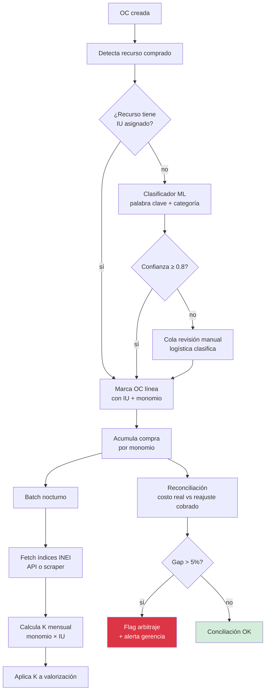

### KPIs nuevos

- `reajuste_cobertura_pct` = reajuste_cobrado / variacion_real_compras
- `iu_clasificacion_pendiente` = OCs sin IU asignado
- `gap_arbitrable` = sobrecosto no cobrado mes

### Prioridad: **CRÍTICA** — sin esto pierdes plata garantizado en obras > 6 meses

---

## P2 · TIMING COSTO CONTABLE INCORRECTO

### Problema detectado

Diseño actual:
```
OC aprobada       → comprometido
Salida almacén    → "consumo" → costo real
Parte diario      → "costo ejecutado"
```

Esto está **mal**. Tres problemas:

1. **Salida almacén ≠ consumo real**: salida = entregado a frente trabajo. Puede no consumirse hoy.
2. **Parte diario como evento contable**: parte diario es **medición productividad**, no evento financiero.
3. **No hay distinción**: `comprometido` (OC firmada) vs `devengado` (recibido + factura) vs `consumido` (usado en partida).

NIIF requiere reconocer costo cuando se **devenga** (factura recibida) NO cuando se "consume teóricamente".

### Riesgo real

```
Caso: residente registra parte diario "vació 5 m³ concreto · 02.01.03"
  Sistema actual: gatilla costo S/ 1,500 partida 02.01.03

Pero:
  Cemento usado: stock previo (de hace 3 OCs distintas)
  Costo promedio kardex no aplicado correctamente
  Sin factura recibida del cemento → contable no reconoce gasto
  Diferencia inventario fin de mes vs producción → no detectada

Resultado: estados financieros mes desbalanceados
         contadora rechaza cierre · obra atrasa pago
```

### Corrección arquitectura · 4 estados costo

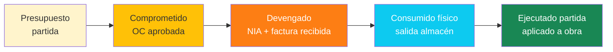

| Estado | Trigger | Contabilidad | Cuenta PCGE |
|---|---|---|---|
| Presupuestado | Carga inicial | — | Memorial |
| **Comprometido** | OC aprobada | Memorial OC | Cuenta orden |
| **Devengado** | NIA + factura SUNAT | Reconoce CxP + IGV crédito | 60/61/62 + 401 |
| **Consumido** | Salida almacén → frente | Reconoce costo · 25 → 92 | 25→79→92 |
| **Ejecutado** | Aplicado a partida específica | Distribución analítica | 92 (centro costo partida) |

### Schema corregido

```sql
-- Costo NO se gatilla en parte diario · solo productividad
costo_eventos (
  id, partida_id, fecha,
  tipo_evento ENUM (
    'compromiso',           -- OC aprobada
    'devengo',              -- factura recibida
    'consumo_almacen',      -- salida kardex
    'aplicacion_partida',   -- aplicado físicamente
    'merma',                -- desperdicio
    'devolucion_almacen',   -- regreso material
    'ajuste_inventario'     -- conciliación
  ),
  monto decimal(14,2),
  origen_tabla varchar(50),  -- 'oc' | 'factura' | 'kardex' | etc
  origen_id uuid,
  reversado_por uuid,        -- self-ref si fue revertido
  asiento_contable_id uuid,
  created_at, created_by
)

-- Parte diario = SOLO productividad
partes_diarios (
  id, partida_id, fecha,
  metrado_ejecutado decimal(14,4),
  unidad varchar(20),
  hh_invertidas decimal(8,2),
  hm_invertidas decimal(8,2),     -- horas máquina
  observaciones,
  registrado_por,
  -- NO tiene campo monto
  -- NO gatilla costo
  -- gatilla solo: avance % partida (físico)
)

-- Conciliación física vs kardex
conciliacion_inventario (
  id, proyecto_id, fecha_corte,
  recurso_id,
  stock_kardex decimal(14,4),
  stock_fisico_inventariado decimal(14,4),
  diferencia decimal(14,4),
  monto_ajuste decimal(14,2),
  motivo varchar,
  asiento_id uuid
)
```

### Flujo correcto

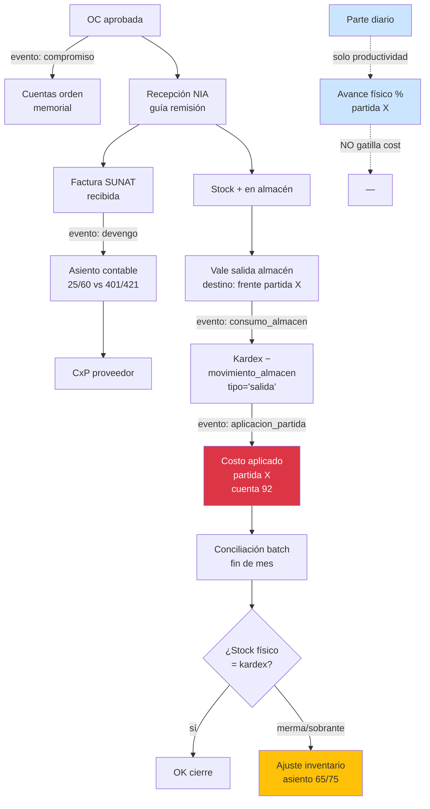

### Eventos contables correctos

```
Evento OC aprobada:
  No genera asiento financiero
  Genera memorial cuenta orden
  Actualiza presupuesto comprometido

Evento factura recibida:
  Dr 60 Compras / 25 Suministros
  Dr 401 IGV crédito fiscal
  Cr 421 Facturas por pagar
  Cr 422 Anticipos otorgados (si hubo)

Evento salida almacén:
  Dr 92 Costos producción · centro = partida
  Cr 25 Suministros / 26 Envases

Evento parte diario:
  NINGÚN asiento financiero
  Solo actualiza %_avance partida

Evento conciliación inventario (fin mes):
  Si merma:
    Dr 65 Otros gastos
    Cr 25 Suministros
  Si sobrante:
    Dr 25 Suministros
    Cr 75 Otros ingresos
```

### Prioridad: **CRÍTICA** — bloquea cierre contable correcto

---

## P3 · SUBCONTRATO BACK-TO-BACK NO MODELADO

### Problema detectado

Diseño actual: subcontrato genérico con valorización SC propia. Sin vinculación con valorización entidad. Esto es **modelo OS clásico**, no obra pública.

En obra pública peruana:
- Contratista valoriza ante entidad (mensual)
- SC valoriza ante contratista
- **NO se debe pagar SC más avance del que entidad reconoció al contratista** (back-to-back)
- Si entidad observa Val 03 contratista, entonces Val 03 SC también queda observada

### Riesgo real

```
Caso: SC HORNO valoriza 70% al contratista
      Contratista paga SC el 70%
      Entidad solo aprueba 50% al contratista (rebote técnico)
      Contratista pagó 20% que NO va a cobrar
      → S/ 83,883 capital atrapado · pérdida flujo
```

Empresa peruana COSAPI reportó 2022: 14% subcontratos con avance SC > avance cliente. Default subcontratista habitual.

### Corrección · modelo back-to-back

```mermaid
flowchart TB
    EJEC_SC[SC ejecuta partida 02.04] --> AVA_SC[Reporta avance 70%]
    AVA_SC --> VAL_SC[Genera Val SC propuesta]

    VAL_SC --> CHK1{¿Val cliente<br/>aprobada del<br/>mismo período<br/>existe?}
    CHK1 -->|no| BLOQ1[BLOQUEO<br/>"Val cliente pendiente"]
    CHK1 -->|sí| CHK2

    CHK2{Avance partida<br/>en Val cliente<br/>≥ avance SC?}
    CHK2 -->|sí| OK[Liberar Val SC]
    CHK2 -->|no| TOL{Diferencia<br/>≤ tolerancia<br/>configurada 5%?}
    TOL -->|sí| WARN[Permite con flag<br/>requiere aprobación gerencia]
    TOL -->|no| LIMIT[Capa Val SC<br/>al avance cliente]

    OK --> AMORT_ADELANTO[− amortizacion adelanto SC]
    AMORT_ADELANTO --> AMORT_SUM[− descuento suministros<br/>modalidad B]
    AMORT_SUM --> RET[− retención SC 10%]
    RET --> FOND[− fondo garantía SC 5%]
    FOND --> NETO[Neto a pagar SC]

    NETO --> CONF{Conformidad técnica<br/>residente + supervisor MM?}
    CONF -->|sí| FAC[SC emite factura]
    CONF -->|no| OBS[Observación<br/>levantar antes pago]

    FAC --> SUNAT_VAL[Validación SUNAT<br/>RUC vigente · habido]
    SUNAT_VAL --> PAGO_SC[Pago SC]

    PAGO_SC --> COBR_CLI{¿Val cliente<br/>cobrada?}
    COBR_CLI -->|sí| LIB_FOND[Libera fondo gar.<br/>al final obra]
    COBR_CLI -->|no| HOLD[Fondo retenido<br/>hasta cobro]

    style BLOQ1 fill:#dc3545,color:#fff
    style LIMIT fill:#fd7e14,color:#fff
    style WARN fill:#ffc107
    style OK fill:#d4edda
    style FAC fill:#cce5ff
```

### Schema completo SC

```sql
subcontratos (
  ... existente
  pct_fondo_garantia decimal(5,4),       -- 5% típico
  modalidad_pago ENUM ('back_to_back','financiado_propio'),
  tolerancia_avance_pct decimal(5,2),    -- 5% gap permitido
  liberacion_fondo_dias integer,         -- 365 vicios ocultos
  estado_carta_fianza_propia varchar     -- SC entrega fianza a MM
)

subcontrato_valorizaciones (
  ... existente
  valorizacion_cliente_id uuid,          -- ★ vincula val entidad
  avance_cliente_pct decimal(5,2),       -- snapshot avance reconocido
  diferencia_avance_pp decimal(5,2),     -- delta SC vs cliente
  status_back_to_back ENUM (
    'pendiente_val_cliente',
    'limitado_a_cliente',
    'aprobado_con_tolerancia',
    'aprobado_sin_restricciones'
  ),
  fondo_garantia_retenido decimal(14,2),
  fondo_garantia_liberado decimal(14,2)
)

fondo_garantia_movimientos (
  id, subcontrato_id, tipo ENUM ('retencion','liberacion','ejecucion'),
  monto, fecha, motivo, asiento_id
)

sc_observaciones (
  id, subcontrato_id, valorizacion_sc_id,
  origen ENUM ('mm_residente','mm_supervisor','entidad','tecnico'),
  descripcion text,
  metrado_observado, monto_observado,
  status ENUM ('pendiente','levantada','rechazada'),
  fecha_apertura, fecha_levantamiento,
  evidencia_nas text
)
```

### Reglas de bloqueo

```sql
-- Pre-aprobación Val SC
CREATE FUNCTION validar_val_sc_back_to_back(val_sc_id uuid)
RETURNS TABLE (puede_aprobar boolean, motivo text) AS $$
BEGIN
  -- 1. Existe val cliente del período
  IF NOT EXISTS (val cliente del mismo período status='aprobada') THEN
    RETURN QUERY SELECT false, 'Val cliente pendiente';
  END IF;

  -- 2. Avance SC ≤ avance cliente + tolerancia
  IF avance_sc > (avance_cliente + tolerancia_partida) THEN
    RETURN QUERY SELECT false, 'Avance SC excede cliente + tolerancia';
  END IF;

  -- 3. Conformidad técnica firmada
  IF NOT EXISTS (conformidad firmada) THEN
    RETURN QUERY SELECT false, 'Falta conformidad técnica';
  END IF;

  -- 4. SC sin observaciones abiertas críticas
  IF EXISTS (observaciones criticas pendientes) THEN
    RETURN QUERY SELECT false, 'Observaciones críticas abiertas';
  END IF;

  RETURN QUERY SELECT true, 'OK';
END $$;
```

### Liberación fondo garantía

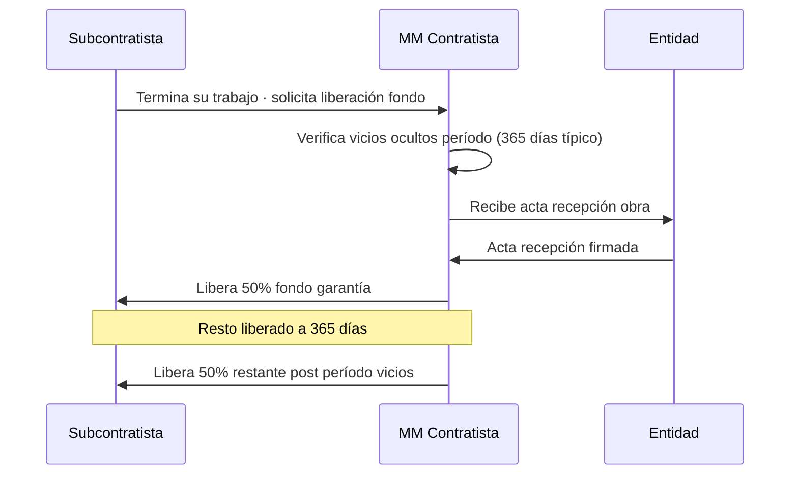

### Prioridad: **CRÍTICA**

---

## P4 · STOCK NEGATIVO + INGRESO PROVISIONAL FALTANTE

### Problema detectado

Diseño actual: prohíbe stock negativo. **Inviable en obra real**.

Realidad: material llega antes que factura. Residente lo usa. Factura llega 5-15 días después. Si bloqueas → paralizas obra.

### Riesgo real

```
Caso: cemento llega 10 sacos · sin guía · sin factura
      Residente lo usa al instante (urgencia vaciado losa)
      Factura llega 8 días después
      ERP rechaza salida porque stock = 0
      → Residente registra "fuera de sistema" en Excel
      → ERP queda desactualizado · costo real desviado
```

### Corrección · 3 estados ingreso

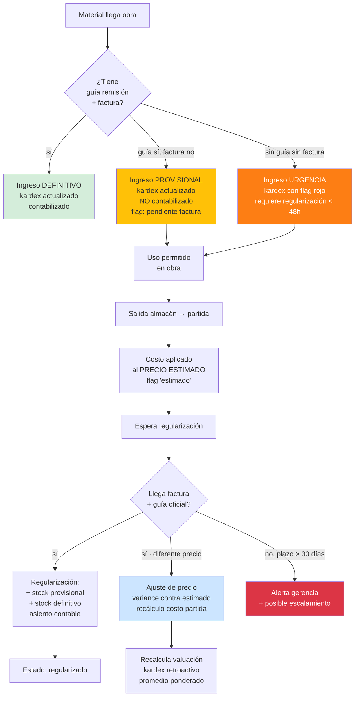

### Schema

```sql
almacen_movimientos (
  ... existente
  estado_documental ENUM (
    'definitivo',         -- guía + factura
    'provisional_guia',   -- solo guía remisión
    'provisional_urgencia', -- nada (frente trabajo)
    'regularizado'        -- ya recibió faltantes
  ),
  precio_estimado decimal(14,4),       -- si provisional
  precio_real decimal(14,4),           -- al regularizar
  variance_precio decimal(14,2),       -- precio_real − estimado
  fecha_limite_regularizacion date,    -- ej +30 días desde ingreso
  guia_remision_serie varchar,
  guia_remision_numero varchar,
  factura_id uuid REFERENCES facturas_recibidas
)

regularizaciones (
  id, movimiento_provisional_id,
  fecha_regularizacion date,
  factura_id uuid,
  diferencia_cantidad decimal(14,4),
  diferencia_precio decimal(14,2),
  asiento_ajuste_id uuid,
  user_id_regularizo
)
```

### Reglas

```
INGRESO PROVISIONAL:
  ✓ Permitido máx 30 días sin factura
  ✓ Stock visible para salidas
  ✗ NO genera CxP hasta factura
  ✗ NO genera crédito fiscal hasta factura
  ! Alerta si > 15 días sin regularizar
  !! Bloqueo gerencia si > 30 días

INGRESO URGENCIA:
  ✓ Permitido máx 48h
  ✓ Requiere foto + firma residente + supervisor
  !! Bloqueo automático si > 48h sin guía
  !!! Auto-escalamiento a gerencia si > 7d
```

### Costo real con provisional

```sql
-- Vista costo real partida con flags
SELECT
  p.id, p.codigo, p.nombre,
  SUM(c.cantidad × c.costo_unitario) AS costo_total,
  SUM(c.cantidad × c.costo_unitario) FILTER (
    WHERE m.estado_documental IN ('provisional_guia','provisional_urgencia')
  ) AS costo_provisional,
  COUNT(*) FILTER (
    WHERE m.estado_documental != 'definitivo'
  ) AS movimientos_pendientes_regularizar
FROM consumos_obra c
JOIN almacen_movimientos m ON m.id = c.movimiento_id
JOIN partidas p ON p.id = c.partida_id
GROUP BY p.id;
```

### Prioridad: **CRÍTICA**

---

## P5 · ADELANTO A PROVEEDORES NO MODELADO

### Problema detectado

Schema actual: factura requiere NIA previa. Pero en obra real:
- Concreto premezclado: 50% adelanto al ordenar
- Acero importado: 70% al pedido
- Hornos cremación: 30-40% adelanto fabricación
- Equipos especiales: 50% al firmar OC

### Riesgo real

Sin modelo:
- Contadora hace cuenta paralela en Excel
- Anticipo no aparece como "comprometido"
- ERP cree que tiene caja que ya gastó
- Cash flow predicho está mal por los anticipos no visibles

### Corrección · flujo anticipo → canje

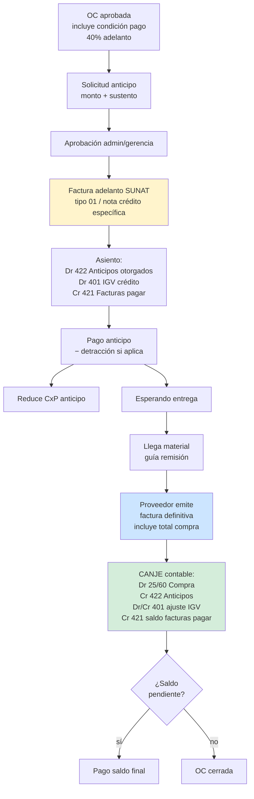

### Schema

```sql
anticipos_proveedores (
  id, oc_id, proveedor_ruc,
  monto_anticipo decimal(14,2),
  pct_anticipo decimal(5,4),
  fecha_solicitud, fecha_pago, fecha_canje,
  factura_anticipo_id uuid,
  factura_canje_id uuid,
  estado ENUM (
    'solicitado',
    'aprobado',
    'pagado',
    'parcialmente_canjeado',
    'totalmente_canjeado',
    'reclamo_devolucion'   -- si proveedor no entrega
  ),
  detraccion_monto decimal(14,2),
  carta_fianza_proveedor uuid REFERENCES garantias  -- si lo respalda
)

facturas_recibidas (
  ... existente
  tipo_factura ENUM ('comercial','adelanto','saldo_canje','nota_credito','nota_debito'),
  factura_relacionada_id uuid,    -- si es saldo, apunta a adelanto
  anticipo_id uuid REFERENCES anticipos_proveedores
)
```

### Reglas

```
1. Anticipo > 30% requiere carta fianza proveedor (alto riesgo)
2. Anticipo > 90 días sin entrega = alerta crítica + escalamiento legal
3. Crédito fiscal IGV solo aplica al canje (no al anticipo)
4. Detracción aplica al pago efectivo (anticipo + saldo)
5. Si proveedor no entrega → flujo legal devolución + ejecución carta fianza
```

### Prioridad: **ALTA**

---

## P6 · DETRACCIÓN + RETENCIÓN + PERCEPCIÓN SUNAT

### Problema detectado

Diseño actual menciona "detracción 12%" pero NO está modelada en schema. SUNAT pega multas por:
- No detraer cuando aplica
- Detraer mal (% incorrecto)
- No declarar PDT detracciones
- Pagar antes de detraer (bloqueo crédito fiscal)

### Códigos SUNAT relevantes

```
Construcción (servicios):
  Código 012 · 4% · contratos construcción
  Código 037 · 12% · servicios general
  Código 040 · 10% · transporte carga
  Código 022 · 12% · arrendamiento muebles
  Código 008 · 12% · alquiler bienes

Bienes:
  Código 014 · 4% · materiales construcción
  Código 020 · 1.5% · cemento
  Código 008 · 1.5% · arena/piedra

Régimen Retención IGV:
  3% sobre operaciones > S/ 700 · proveedor en régimen
  Solo si comprador es agente retenedor

Régimen Percepción IGV:
  Aplica al COMPRAR · proveedor cobra extra
  Diversos productos (combustible 1%, gas 2%, etc)

SPOT Bancarización:
  Pagos > S/ 3,500 ó USD 1,000 · vía banco obligatorio
```

### Flujo SUNAT en pago a proveedor

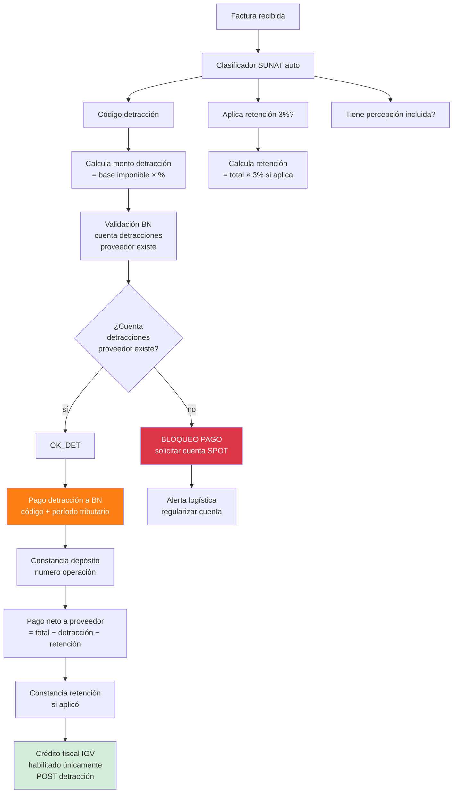

### Schema

```sql
sunat_detracciones_codigos (
  codigo varchar(3) PRIMARY KEY,        -- "037"
  descripcion text,
  porcentaje decimal(5,4),               -- 0.12
  monto_minimo_aplicar decimal(14,2),    -- > S/ 700 típico
  vigencia_desde date,
  vigencia_hasta date
)

facturas_recibidas (
  ... existente
  detraccion_codigo varchar(3),
  detraccion_pct decimal(5,4),
  detraccion_base decimal(14,2),
  detraccion_monto decimal(14,2),
  detraccion_pagada boolean DEFAULT false,
  detraccion_constancia_numero varchar,
  detraccion_fecha_pago date,

  retencion_igv_aplica boolean,
  retencion_igv_monto decimal(14,2),
  retencion_constancia_numero varchar,

  percepcion_igv_monto decimal(14,2),    -- ya incluida por proveedor

  bloqueo_pago boolean DEFAULT false,
  motivo_bloqueo text,

  cuenta_spot_proveedor varchar(20)
)

detracciones_pagos (
  id, factura_id, fecha_pago, monto,
  banco_destino varchar default 'BN',
  numero_operacion varchar,
  numero_constancia varchar,
  periodo_tributario char(7),           -- "2025-12"
  archivo_constancia_nas text
)

retenciones_emitidas (
  id, factura_id, fecha,
  monto, numero_constancia,
  archivo_constancia_nas text
)
```

### Bloqueos automáticos

```sql
-- Pre-pago: validar SUNAT
CREATE FUNCTION puede_pagar_factura(factura_id uuid)
RETURNS TABLE (puede boolean, motivos text[]) AS $$
DECLARE
  motivos text[] := '{}';
BEGIN
  -- 1. Detracción si aplica
  IF detraccion_aplica AND NOT detraccion_pagada THEN
    motivos := array_append(motivos, 'Detracción no pagada');
  END IF;

  -- 2. Cuenta SPOT proveedor existe
  IF detraccion_aplica AND cuenta_spot IS NULL THEN
    motivos := array_append(motivos, 'Cuenta SPOT proveedor faltante');
  END IF;

  -- 3. RUC proveedor habido en SUNAT
  IF NOT proveedor_habido_sunat() THEN
    motivos := array_append(motivos, 'RUC no habido SUNAT');
  END IF;

  -- 4. Factura validada xml SUNAT
  IF NOT factura_validada THEN
    motivos := array_append(motivos, 'Factura no validada');
  END IF;

  RETURN QUERY SELECT array_length(motivos,1) IS NULL, motivos;
END $$;
```

### Prioridad: **CRÍTICA**

---

## P7 · GARANTÍAS · DISEÑO INCOMPLETO

### Problema detectado

Schema `garantias` solo cubre tipos básicos. Falta:
- Renovación automática
- Costo financiero por mes
- Línea bancaria consumida
- Pólizas (CAR, SCTR, RC)
- Triggers por modificaciones contractuales
- Garantías que entregan los SC al contratista

### Cobertura completa garantías

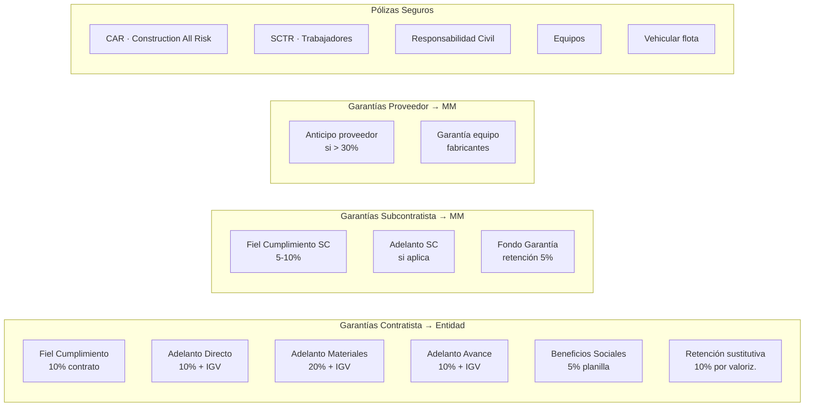

### Schema enterprise

```sql
garantias (
  id, proyecto_id,
  tipo_garantia ENUM (...),
  emisor_tipo ENUM ('contratista_a_entidad','sc_a_contratista','proveedor_a_contratista'),

  -- Documento
  numero_carta varchar,
  banco_emisor varchar,
  numero_operacion_banco varchar,
  archivo_pdf_nas text,

  -- Montos
  monto decimal(14,2),
  monto_cobertura decimal(14,2),         -- algunos cubren más que el monto
  moneda char(3) default 'PEN',

  -- Vigencia
  fecha_emision date,
  vigencia_desde date,
  vigencia_hasta date,
  dias_renovacion_alerta int default 30,

  -- Estado
  estado ENUM (
    'vigente',
    'por_vencer',           -- alerta 30 días
    'vencida',
    'renovada',
    'ejecutada',
    'devuelta'
  ),

  -- Renovaciones
  garantia_padre_id uuid,                -- si es renovación
  numero_renovacion int default 0,

  -- Costo financiero
  comision_emision decimal(14,2),
  tasa_comision_anual decimal(5,4),       -- 0.04 = 4%
  costo_total_financiero decimal(14,2),   -- calculado mes a mes

  -- Línea banco
  linea_bancaria_id uuid,
  consume_linea boolean default true,

  -- Triggers
  modificacion_contractual_id uuid,       -- si fue por amp.plazo etc
  evento_disparador varchar,

  created_at, updated_at
)

polizas_seguros (
  id, proyecto_id,
  tipo ENUM ('CAR','SCTR','RC','equipos','vehicular','tdv'),
  aseguradora varchar,
  numero_poliza varchar,
  prima decimal(14,2),
  prima_moneda char(3),
  cobertura_total decimal(14,2),
  deducible decimal(14,2),
  vigencia_desde, vigencia_hasta,
  archivo_pdf_nas text,
  estado ENUM ('vigente','por_vencer','vencida','renovada','siniestrada')
)

linea_bancaria (
  id, banco varchar, ruc_titular varchar(11),
  monto_aprobado decimal(14,2),
  monto_consumido decimal(14,2),
  monto_disponible decimal(14,2) GENERATED AS (monto_aprobado - monto_consumido),
  fecha_aprobacion, fecha_renovacion,
  tasa_comision_anual decimal(5,4)
)

linea_bancaria_movimientos (
  id, linea_id, fecha,
  tipo ENUM ('emision_carta','liberacion_carta','renovacion','ejecucion'),
  garantia_id uuid,
  monto decimal(14,2),
  monto_disponible_post decimal(14,2)
)
```

### Renovación automática

```mermaid
flowchart TB
    NIGHT[Cron diario 00:00] --> SCAN[Scan garantías<br/>vigencia_hasta − today]
    SCAN --> CASE{Días para<br/>vencer}

    CASE -->|≤ 30 días| ALERT_1[Alerta admin<br/>"Renovar garantía X"]
    CASE -->|≤ 7 días| ALERT_2[Alerta gerencia<br/>"URGENTE renovar"]
    CASE -->|≤ 0 días| BLOQ[BLOQUEO valorizaciones<br/>+ alerta legal]

    ALERT_1 --> WORK[Workflow renovación]
    WORK --> SOL_BANCO[Solicitud banco<br/>renovación]
    SOL_BANCO --> NEW_FIA[Nueva carta fianza<br/>misma cobertura<br/>+ vigencia extendida]

    NEW_FIA --> ENT[Entrega entidad/SC]
    ENT --> SUST[Sustituye anterior<br/>garantia_padre_id link]
    SUST --> LIB[Libera anterior<br/>banco recupera línea]

    LIB --> CONS[Costo financiero<br/>devengado al mes]

    style BLOQ fill:#dc3545,color:#fff
    style ALERT_2 fill:#fd7e14,color:#fff
    style ALERT_1 fill:#ffc107
```

### Costo financiero devengado

```sql
-- Devengo mensual costo carta fianza
CREATE FUNCTION devengar_costo_garantia_mes()
RETURNS void AS $$
INSERT INTO costo_financiero_devengado (
  garantia_id, periodo_mes,
  monto_devengado,
  asiento_id
)
SELECT
  g.id,
  to_char(now(), 'YYYY-MM'),
  (g.monto * g.tasa_comision_anual / 12),
  generar_asiento_devengo(g.id)
FROM garantias g
WHERE g.estado = 'vigente'
  AND now() BETWEEN g.vigencia_desde AND g.vigencia_hasta;
$$;
```

### Triggers contractuales

```
Adicional aprobado:
  → Recalcula monto_vigente
  → Si monto_vigente × pct_fc > carta_fc actual
    → Solicita ENDOSO carta fianza (incrementa cobertura)
    → O nueva fianza complementaria

Ampliación plazo:
  → Vigencia carta fianza < nueva fecha fin
    → ENDOSO vigencia
```

### Prioridad: **CRÍTICA**

---

## P8 · CURVA S, EVM Y COSTOS · ERRORES CONCEPTUALES

### Problemas detectados

1. **EV mal definido**: documento dice "EV = costo presupuestado del trabajo realizado". Correcto pero falta precisar **a precios contractuales o referenciales**.

2. **Curva S única**: deberían ser **3 curvas S simultáneas**:
   - Físico (% metrado)
   - Financiero programado (S/ valorizable)
   - Costo real (S/ ejecutado)

3. **Sin línea base versionada en EVM**: SPI/CPI deben recalcularse contra **baseline vigente**, no original. Si hubo amp.plazo, comparar contra original sería injusto.

4. **Falta corrección por reducción/adicional**: EVM clásico asume scope fijo. En obras públicas el scope cambia.

### Modelo EVM corregido

```
PV (Planned Value)     = costo programado × baseline_vigente al fecha corte
EV (Earned Value)      = avance_físico × costo_referencial_partida
                         (a precios PRESUPUESTO REFERENCIAL no contractual)
AC (Actual Cost)       = costo real consumido × promedio ponderado kardex
                         + MO real (planilla cargada)
                         + SC real (pagos)
                         + GG prorrateado real

Indicadores:
SPI  = EV / PV       schedule
CPI  = EV / AC       costo
TCPI = (BAC − EV) / (BAC − AC)  to-complete

Forecast:
EAC  = AC + (BAC − EV) / CPI    optimista (sigue trend)
EAC  = AC + (BAC − EV) / (CPI × SPI)  pesimista
ETC  = EAC − AC
VAC  = BAC − EAC

donde BAC = Budget At Completion = monto_referencial CD × baseline_vigente
```

### Schema EVM

```sql
evm_snapshots (                          -- snapshot mensual
  id, proyecto_id, fecha_corte, baseline_id,
  pv decimal(14,2),
  ev decimal(14,2),
  ac decimal(14,2),
  bac decimal(14,2),
  spi decimal(7,4),
  cpi decimal(7,4),
  tcpi decimal(7,4),
  eac decimal(14,2),
  etc decimal(14,2),
  vac decimal(14,2),
  forecast_finish_date date,
  alerta_atraso boolean,
  alerta_sobrecosto boolean,
  created_at
)

evm_partida_snapshots (                  -- detalle por partida
  evm_id, partida_id,
  pv_partida, ev_partida, ac_partida,
  spi_partida, cpi_partida
)
```

### Curva S triple

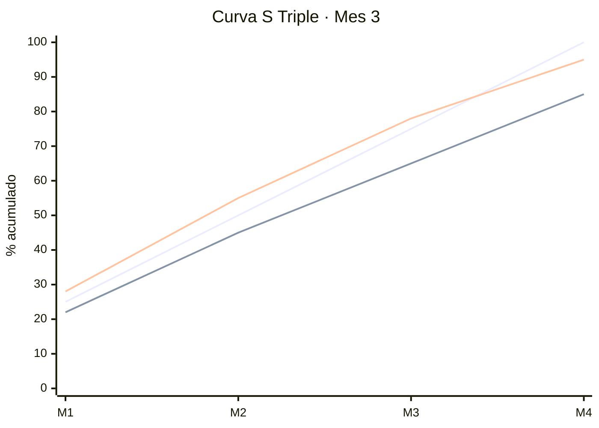

Línea verde: programado · Azul: real físico · Roja: costo real (% del BAC consumido)

Si **costo real % > físico %** → CPI < 1 → estás gastando más rápido que avanzando.

### Prioridad: **ALTA**

---

## P9 · CONSORCIOS · GAPS CRÍTICOS

### Problemas detectados

Schema `consorcios_integrantes` solo tiene datos básicos. Faltan:
- **Cuentas bancarias específicas** consorcio
- **Cuentas de orden** entre socios (préstamos internos)
- **Distribución utility** automatizada
- **Aporte capital inicial** por socio
- **Garantías compartidas** quién aportó qué carta fianza
- **Resoluciones internas** consorcio (acuerdos, modificaciones convenio)

### Modelo completo

```sql
consorcios (
  id, proyecto_id,
  nombre varchar,                          -- "CONSORCIO LIMA"
  ruc_consorcio varchar(11),               -- si tiene RUC propio (no este caso)
  domicilio_legal text,
  email_notificaciones varchar,
  representante_comun_dni varchar,
  representante_comun_nombre varchar,
  fecha_constitucion date,
  fecha_inicio_vigencia date,
  fecha_fin_vigencia date,
  archivo_contrato_consorcio_nas text,
  status ENUM ('vigente','liquidado','disuelto')
)

consorcios_integrantes (
  ... existente
  + es_operador_tributario boolean,        -- quien factura entidad
  + es_operador_administrativo boolean,    -- quien lleva contabilidad
  + cci_aporte varchar(20),                -- cuenta interbancaria propia
  + email_principal varchar,
  + telefono_principal varchar,
  + capital_aportado decimal(14,2),
  + experiencia_acreditada jsonb           -- obras previas
)

consorcio_cuentas_bancarias (
  id, consorcio_id, banco varchar, numero_cuenta varchar,
  cci varchar(20), moneda char(3),
  proposito ENUM ('cobranzas','pagos','garantias','adelantos'),
  titular_ruc varchar(11)                  -- típicamente operador tributario
)

consorcio_movimientos_internos (         -- cuentas de orden
  id, consorcio_id, fecha,
  tipo ENUM ('aporte_capital','prestamo_socio','devolucion','distribucion_utility','reparto_costos'),
  socio_origen_id uuid,
  socio_destino_id uuid,
  monto decimal(14,2),
  tasa_interes_anual decimal(5,4),         -- si préstamo
  concepto text,
  asiento_orden_id uuid
)

consorcio_distribucion_utility (
  id, consorcio_id, fecha_corte,
  utility_total decimal(14,2),
  detalle jsonb                             -- por socio: %, monto, retenciones
)

consorcio_resoluciones_internas (
  id, consorcio_id, numero, fecha,
  tipo ENUM ('acuerdo','modificacion','sustitucion_representante','disolucion'),
  descripcion text,
  votos_favor int, votos_contra int,
  archivo_acta_nas text
)
```

### Flujo distribución utility

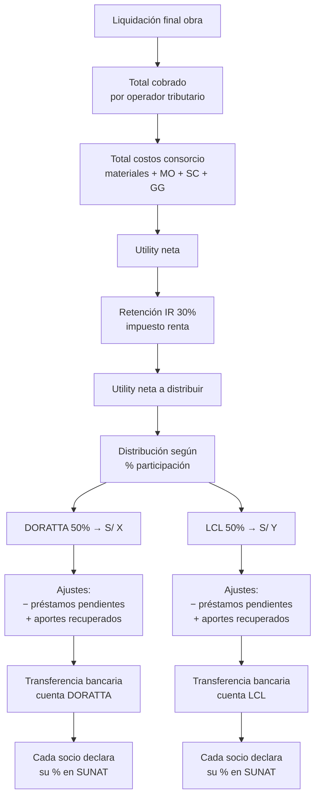

### Préstamos entre socios

Caso real PG0005: si DORATTA paga 100% de la planilla con su caja, está prestando a LCL su 50%.

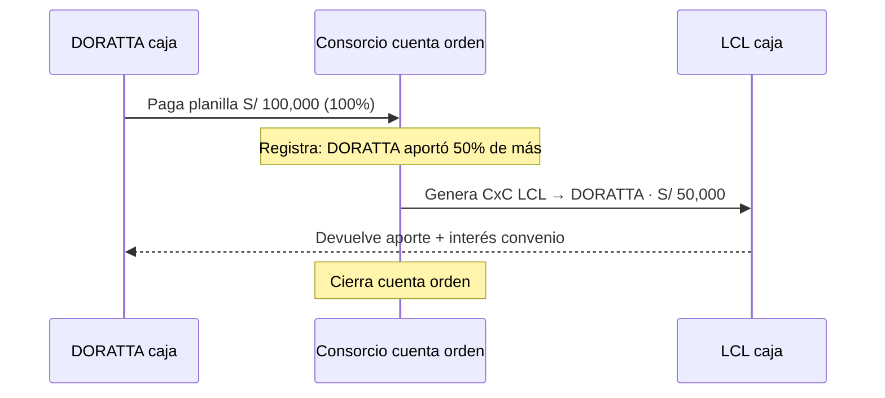

### Prioridad: **ALTA**

---

## P10 · ENTERPRISE-GRADE · GAPS PARA COMPETIR S10/SAP

### Lo que falta para nivel enterprise

#### Performance + escalabilidad

```sql
-- CQRS: separar lectura/escritura
-- Comando (write): tablas normalizadas
-- Query (read): materialized views denormalizadas

CREATE MATERIALIZED VIEW v_proyecto_dashboard AS
SELECT
  p.id, p.codigo, p.nombre,
  p.monto_vigente,
  -- Avance físico
  (SELECT AVG(percent_complete) FROM partidas WHERE proyecto_id = p.id) AS avance_fisico,
  -- Avance financiero
  (SELECT SUM(monto_total) FROM valorizaciones
   WHERE proyecto_id = p.id AND status = 'cobrada') AS cobrado,
  -- Costo real
  cost_real_proyecto(p.id) AS costo_real,
  -- KPIs EVM
  (SELECT spi FROM evm_snapshots WHERE proyecto_id = p.id ORDER BY fecha_corte DESC LIMIT 1) AS spi,
  ...
FROM proyectos p;

-- Refresh nightly
REFRESH MATERIALIZED VIEW CONCURRENTLY v_proyecto_dashboard;
```

#### Event sourcing · audit inmutable

```sql
-- Tabla append-only · NUNCA UPDATE/DELETE
domain_events (
  id uuid PRIMARY KEY DEFAULT gen_random_uuid(),
  sequence_number bigserial,                -- orden global
  aggregate_type varchar,                   -- 'proyecto','valorizacion','oc'
  aggregate_id uuid,
  event_type varchar,                       -- 'ProyectoCreated','ValAprobada'
  event_version int default 1,
  payload jsonb,                            -- datos del evento
  metadata jsonb,                           -- user_id, ip, request_id, correlation_id
  occurred_at timestamp with time zone default now(),
  recorded_at timestamp with time zone default now()
);
CREATE INDEX ON domain_events (aggregate_type, aggregate_id, sequence_number);
CREATE INDEX ON domain_events (event_type);
CREATE INDEX ON domain_events (occurred_at);

-- INSERT ONLY policy
REVOKE UPDATE, DELETE ON domain_events FROM PUBLIC;

-- Eventos típicos:
-- ProyectoLicitado
-- ProyectoAdjudicado
-- ContratoFirmado
-- ActaInicioFirmada
-- AdelantoSolicitado / Aprobado / Pagado
-- ValBorrador / Emitida / Aprobada / Cobrada
-- OCAprobada / Recibida / Facturada / Pagada
-- IngresoAlmacen / SalidaAlmacen
-- TareoRegistrado
-- PartidaAvanzada
-- ModificacionAprobada
-- GarantiaEmitida / Renovada / Vencida
-- PenalidadAplicada
-- LiquidacionAprobada
```

#### DDD · Bounded contexts

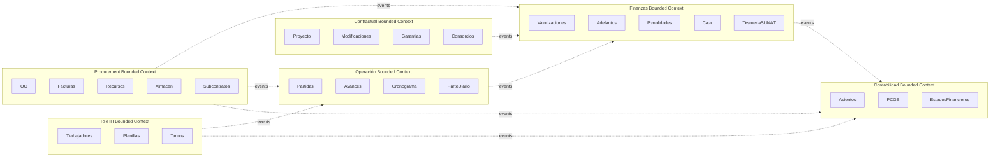

#### Multi-tenant + multi-empresa

```sql
empresas (
  id uuid PRIMARY KEY,
  ruc varchar(11) UNIQUE,
  razon_social, ...
)

-- Toda tabla principal lleva empresa_id
proyectos      (..., empresa_id uuid REFERENCES empresas)
recursos       (..., empresa_id uuid)
trabajadores   (..., empresa_id uuid)
ordenes_compra (..., empresa_id uuid)

-- RLS (Row Level Security)
ALTER TABLE proyectos ENABLE ROW LEVEL SECURITY;
CREATE POLICY tenant_isolation ON proyectos
  USING (empresa_id = current_setting('app.current_tenant')::uuid);
```

#### Integración bancaria

```
Entidades a integrar:
  BCP    → API CCE / Telecredit
  BBVA   → Cash Management
  Nación → SIAF / Transferencias
  Interbank → Telebanking

Conciliación:
  Statement file (BCP-MT940 / OFX) → ingesta auto
  Match: factura_id + monto + fecha → marcar como pagada
  Excepciones → cola revisión manual
```

#### Integración SUNAT

```
SOAP/REST endpoints:
  - Consulta RUC (validación habido)
  - Validación factura emitida (XML CDR)
  - PLE / SIRE upload (libros electrónicos)
  - PDT detracciones declaración
  - Constancia depósito SPOT

Cron diario:
  - Validar todos los RUCs proveedores activos
  - Validar facturas emitidas
  - Sincronizar con SUNAT cualquier nota crédito/débito
```

#### Integración SEACE

```
SEACE Pladicop API (cuando esté disponible):
  - Reportes mensuales valorización
  - Subida documentos contractuales
  - Notificación adendas/modificaciones
  - Consulta procesos selección activos
```

#### OCR documentos

```
Pipeline:
  PDF/imagen → OCR (AWS Textract / Google Doc AI) →
  → clasificación (factura | guía | contrato | acta) →
  → extracción campos clave →
  → match con OC/factura existente →
  → registro automático con flag "auto_ocr_review"
```

#### ML / forecasting

```
Modelos:
  1. Forecast utility final · regresión sobre KPIs intermedios
  2. Predicción atraso · clasificador SPI/CPI trends
  3. Detección anomalía precios compra · isolation forest
  4. Clasificación auto IU recursos · NLP texto descripción
  5. Detección riesgo penalidad · multivariable
```

#### Cashflow predictivo

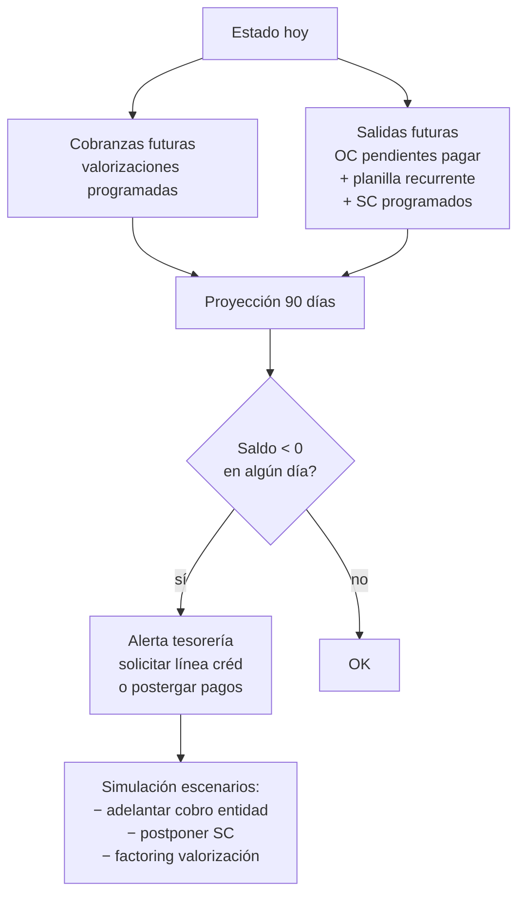

#### Procurement avanzado

```
Features:
  - RFQ (Request For Quotation) digital
  - Comparativos cotizaciones lado a lado
  - Catálogo proveedores con scoring
  - Marketplace integrado SC
  - Compras agrupadas multi-obra (volumen)
  - Contratos marco con proveedores recurrentes
  - Pre-aprobación líneas crédito proveedores
```

#### BI · KPIs gerenciales

```
Dashboards:
  Nivel proyecto: SPI, CPI, utility, atraso, riesgo
  Nivel empresa: Σ proyectos · margen agregado · pipeline · backlog
  Nivel financiero: cashflow consolidado · líneas bancarias · garantías vigentes
  Nivel operativo: rendimiento partidas · variance APU · productividad CAPECO
```

### Prioridad gaps tier 4 escalada

| Tier | Items | Plazo |
|---|---|---|
| **Tier 4-A** crítico | Event sourcing, CQRS, multi-tenant, RLS | 6 meses |
| **Tier 4-B** alto | Integración bancaria, SUNAT, OCR | 12 meses |
| **Tier 4-C** estratégico | ML forecasting, SEACE API, BI avanzado | 18-24 meses |

---

## RESUMEN EJECUTIVO · ROADMAP CORRECCIONES

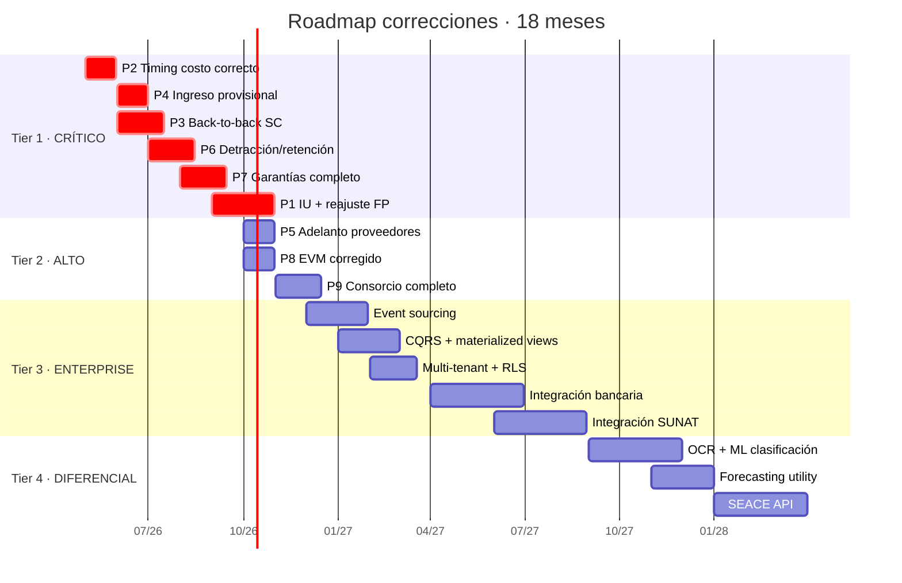

## Checklist ANTES de codear MVP

- [ ] Schema corregido P2 (estados costo)
- [ ] Schema corregido P4 (ingreso provisional)
- [ ] Schema corregido P3 (back-to-back SC)
- [ ] Schema corregido P6 (detracciones SUNAT)
- [ ] Schema corregido P7 (garantías + pólizas + línea bancaria)
- [ ] Schema corregido P1 (IU + monomios + reajuste estructurado)
- [ ] Schema corregido P5 (anticipo proveedor + canje)
- [ ] Domain events table creada
- [ ] Bounded contexts definidos
- [ ] RLS empresa_id habilitado

Sin estos checks → no codear. Codear ahora = re-codear en 6 meses.

## Próximos archivos generados

Ver `docs/flujos/13-` a `36-` para flujos enterprise detallados.
